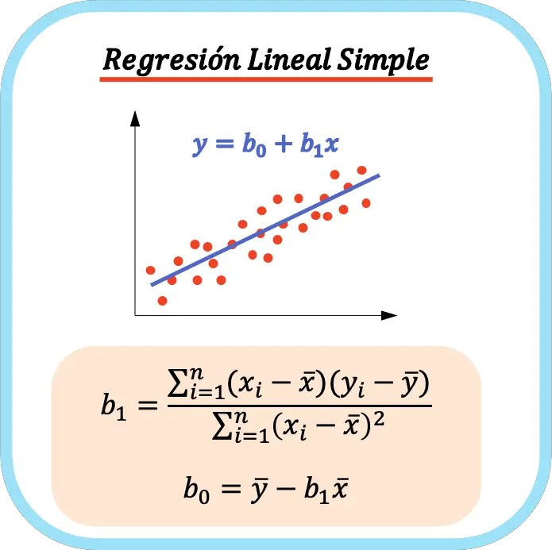

# Regresión Lineal

## Definición
La **regresión lineal** es una técnica estadística utilizada para modelar la relación entre una variable dependiente (respuesta) y una o más variables independientes (predictores). Se asume que la relación entre las variables es lineal, es decir, se puede representar mediante una línea recta.

## Ecuación de la Regresión Lineal
La ecuación general de una regresión lineal simple (una variable independiente) es:
$$ y = \beta_0 + \beta_1 x $$
Donde:
- $y$: Variable dependiente (lo que se quiere predecir)
- $x$: Variable independiente (el predictor)
- $\beta_0$: Intercepto (valor de $y$ cuando $x=0$)
- $\beta_1$: Pendiente (cambio en $y$ por unidad de cambio en $x$)

## Objetivo
El objetivo de la regresión lineal es encontrar los valores de $\beta_0$ y $\beta_1$ que minimicen la suma de los errores cuadrados entre los valores observados y los valores predichos por el modelo.

## Aplicaciones
La regresión lineal se utiliza en una amplia gama de campos como economía, biología, ingeniería y ciencias sociales para:
- Predecir valores futuros.
- Identificar tendencias.
- Estimar relaciones entre variables.

## Ejemplo
Imaginemos que queremos predecir el precio de una casa ($y$) en función de su tamaño ($x$):
- Si los datos de tamaño y precio forman una relación aproximadamente lineal, podemos aplicar regresión lineal.
- El modelo nos dará una ecuación, por ejemplo: $Precio = 50000 + 150 * Tamaño$.
- Esto significa que por cada unidad de aumento en el tamaño, el precio aumenta en 150 unidades monetarias.

